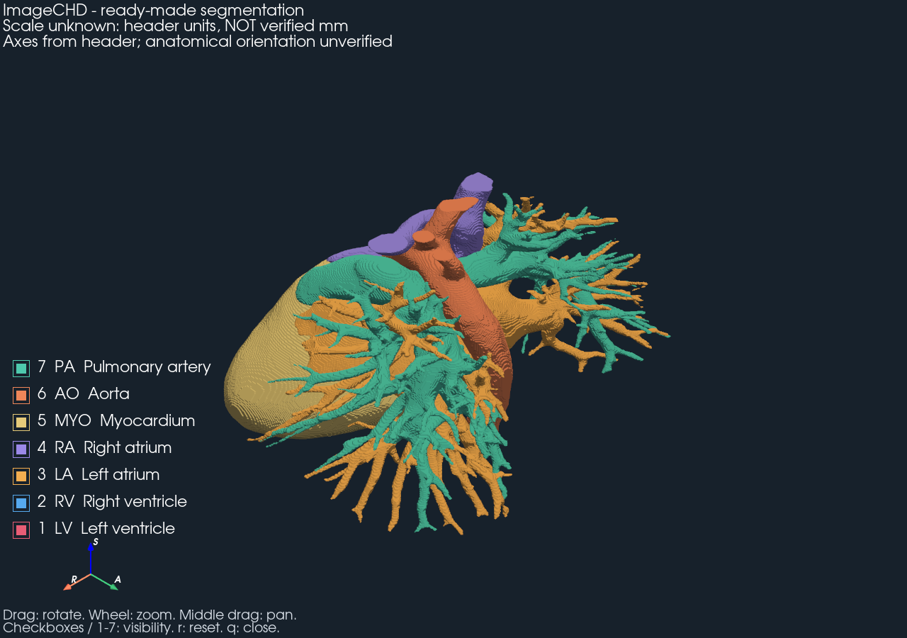
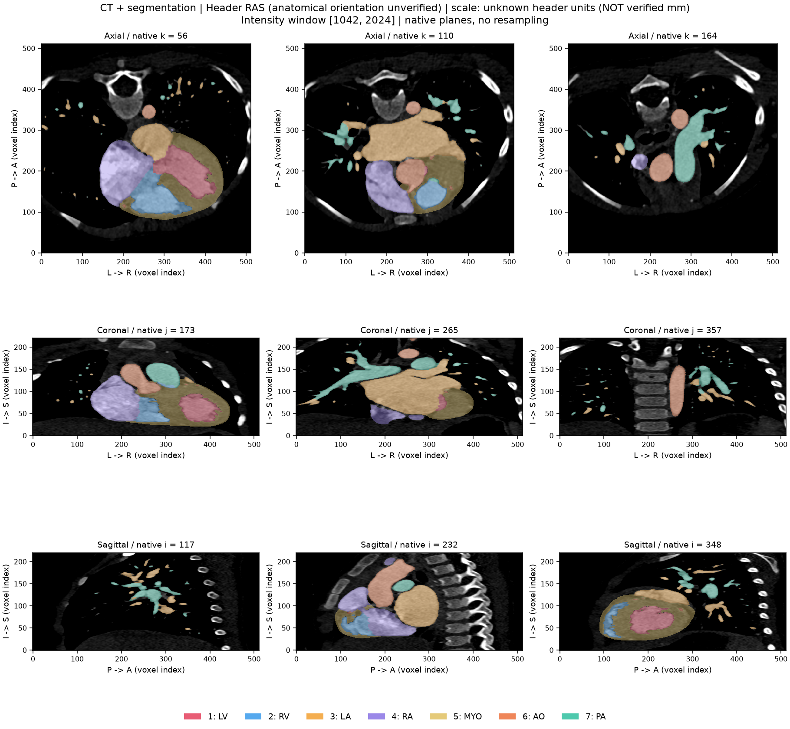

# Трёхмерная реконструкция анатомии сердца по данным КТ

Практическая часть магистерской работы **«Методика трёхмерной реконструкции и визуализации анатомии сердца по данным компьютерной томографии»**.

Первый прототип воспроизводит цепочку **КТ + готовая сегментация → проверка геометрии → поверхности → интерактивная 3D-визуализация**. Данные — [ImageCHD](https://www.kaggle.com/datasets/xiaoweixumedicalai/imagechd). Реализация на Python: NiBabel, NumPy, scikit-image и PyVista/VTK.

**Статус:** цепочка выполнена на реальном случае `ct_1001`. Получены семь поверхностей и девять срезов с маской. Физический масштаб и анатомическая ориентация данных пока не подтверждены. Используется готовая разметка; собственная сегментация и гемодинамика в этот этап не входят.

## Результат без установки



*Поверхности по исходной маске, без сглаживания и удаления компонент. Единицы координат неизвестны. Изображение статическое; вращение и переключатели доступны в локальном viewer.*



*По три среза в каждой плоскости. Направления осей взяты из заголовка и требуют независимой проверки. Цвета структур одинаковы в 2D и 3D.*

Материалы для просмотра:

- [Отчёт первого этапа: методика, результаты и проблемы](docs/first_run.md).
- [Пример JSON-отчёта по ct_1001](docs/examples/ct_1001_report.json): геометрия, метки, характеристики mesh и версии библиотек.
- [Подробная инструкция воспроизведения](docs/reproduction.md).

## Что реализовано

| Этап | Результат |
|---|---|
| Изучение набора | Проверен каталог архива: 110 пар NIfTI и две таблицы XLSX |
| Загрузка | Извлечение одной пары из многотомного ZIP, проверка CRC32 и фиксация SHA-256 |
| Геометрия | Размеры, spacing, affine, qform/sform, единицы и целочисленные метки |
| Срезы | Девять КТ-срезов с маской, без интерполяции меток |
| Реконструкция | Marching cubes отдельно для каждой структуры, полная affine применяется к вершинам |
| Viewer | Вращение, масштабирование, перемещение, независимая видимость структур |
| Воспроизводимость | Зафиксированные зависимости, JSON-отчёт и тесты |

## Выявленные ограничения

- **Масштаб:** сетки КТ и маски совпадают, размеры — `512 × 512 × 221`, но spacing равен `1 × 1 × 1`, единицы — `unknown`. Миллиметры и миллилитры не подтверждены.
- **Ориентация:** RAS записана в заголовке; соответствие направлениям пациента нужно проверить независимо. Автоматического переворота данных нет.
- **Интенсивности:** диапазон `0…4095` не интерпретируется как подтверждённая шкала HU.
- **Маска и mesh:** у LA, MYO и PA есть малые компоненты, у MYO — 12 неманифолдных рёбер. Они сохранены и отражены в отчёте.

Совпадение сеток проверено. Достоверность исходной физической геометрии — отдельная незавершённая задача. [Подробный разбор](docs/first_run.md#найденные-проблемы).

## Быстрый запуск

Проверенная среда: **Windows, Python 3.14**. Команды для PowerShell. Загрузка примера — около 203 МБ; весь набор не требуется.

```powershell
git clone https://github.com/Andrew2002acmr/3d-heart.git
cd 3d-heart
py -3.14 -m venv .venv
.\.venv\Scripts\python.exe -m pip install -r requirements-lock.txt
.\.venv\Scripts\python.exe scripts\fetch_sample.py
.\.venv\Scripts\python.exe -m heart3d build --ct data\imagechd\ct_1001_image.nii.gz --mask data\imagechd\ct_1001_label.nii.gz --out outputs\ct_1001_v1 --preview
.\.venv\Scripts\python.exe -m heart3d view outputs\ct_1001_v1
```

При повторном построении выберите новую папку `--out`: результаты не перезаписываются. GPU/CUDA для вычислений не требуются. Для окна и `--preview` нужен работающий графический контекст VTK. Без `--preview` сохраняются срезы, mesh и отчёт без открытия окна.

**Управление:** левая кнопка — вращение, колесо — масштаб, средняя кнопка — перемещение. Флажки или `1–7` — видимость; `r` — сброс камеры; `q` — закрытие. Отключите `MYO`, чтобы рассмотреть внутренние камеры.

## Структура

```text
heart3d/                Чтение данных, геометрия, срезы, mesh, viewer и CLI
scripts/fetch_sample.py Загрузчик примера ImageCHD
tests/                  Геометрические проверки и тест viewer
docs/                   Отчёт, инструкция, изображения и пример JSON
requirements-lock.txt   Точные версии проверенной среды
requirements.txt        Диапазоны зависимостей
```

`data/`, `outputs/` и `.venv/` создаются локально и не входят в Git. Исходные NIfTI, таблицы набора и объёмные mesh здесь не публикуются. Иллюстрации и пример отчёта в `docs/` позволяют оценить результат без скачивания данных.

## Проверки

```powershell
.\.venv\Scripts\python.exe -m pytest -q
```

Локально прошли **12 тестов**: известная геометрическая фигура с анизотропным spacing, отражением и переносом; несовпадение сеток; некорректные маски; реальное событие переключателя VTK, вращение и zoom. Срезы и 3D-превью реального случая просмотрены визуально.

GitHub Actions запускает тесты геометрии на Windows без загрузки ImageCHD. Графический тест viewer выполняется локально, поскольку требует графического контекста. Статус CI — на вкладке [Actions](https://github.com/Andrew2002acmr/3d-heart/actions). Зафиксированные NumPy/scikit-image дают предупреждения об устаревающем API внутри библиотеки; локальные тесты проходят.

## Следующий этап

1. Подтвердить связь ID файлов с таблицей параметров сканирования, spacing, ориентацию и шкалу интенсивности.
2. Проверить методику на дополнительных случаях и выполнить пакетный аудит набора.
3. Исследовать дефекты топологии и влияние опционального сглаживания/упрощения на геометрию.

## Данные и источники

ImageCHD предоставлен авторами набора. Изображения и маски не являются результатом сегментации, разработанной в этом проекте. Использование исходных данных определяется условиями их источника.

- [ImageCHD на Kaggle](https://www.kaggle.com/datasets/xiaoweixumedicalai/imagechd).
- [Репозиторий авторов и описание меток](https://github.com/XiaoweiXu/ImageCHD-A-3D-Computed-Tomography-Image-Dataset-for-Classification-of-Congenital-Heart-Disease).
- [Публикация ImageCHD](https://arxiv.org/abs/2101.10799).
- [NiBabel: координаты и affine](https://nipy.org/nibabel/coordinate_systems.html).
- [scikit-image: marching cubes](https://scikit-image.org/docs/stable/api/skimage.measure.html#skimage.measure.marching_cubes).

Метки авторов: `1 LV`, `2 RV`, `3 LA`, `4 RA`, `5 MYO`, `6 AO`, `7 PA`; `0` — фон.
