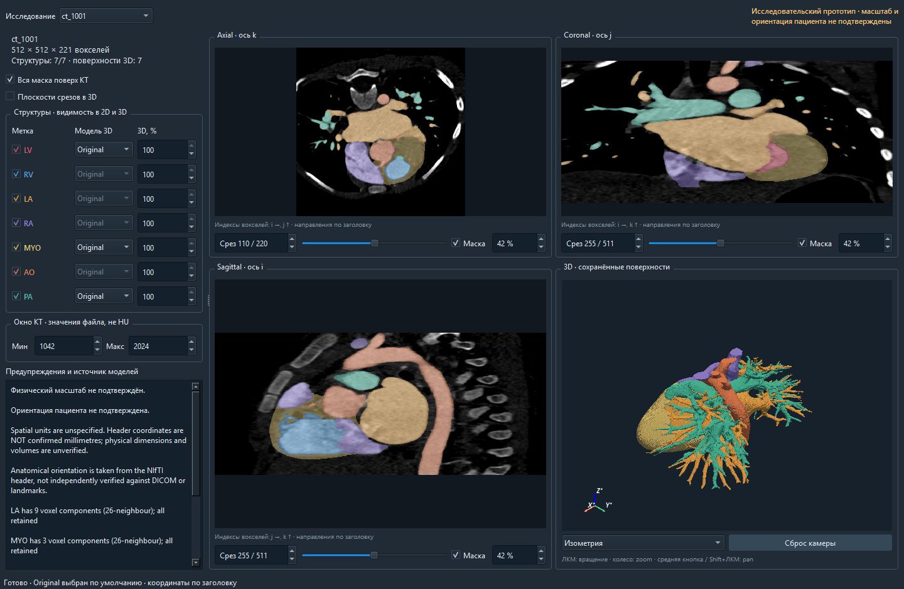

# Трёхмерная реконструкция анатомии сердца по данным КТ

Практическая часть магистерской работы **«Методика трёхмерной реконструкции и визуализации анатомии сердца по данным компьютерной томографии»**.

Первый прототип воспроизводит цепочку **КТ + готовая сегментация → проверка геометрии → поверхности → интерактивная 3D-визуализация**. Данные — [ImageCHD](https://www.kaggle.com/datasets/xiaoweixumedicalai/imagechd). Реализация на Python: NiBabel, NumPy, scikit-image и PyVista/VTK.

**Статус:** выполнена проверка `ct_1001–ct_1004`: 27 исходных поверхностей, независимое чтение геометрии и эксперимент сглаживания/упрощения. Совпадение сеток КТ и маски подтверждено; физический масштаб остаётся неизвестным, а направление A/P заголовка противоречит наблюдаемым ориентирам. Используется готовая разметка; собственная сегментация и гемодинамика в этот этап не входят. **[Отчёт проверки геометрии и команды повторного запуска](docs/geometry_validation.md).**

**Интерактивный прототип:** КТ в трёх плоскостях, готовая маска и 3D-модель в одном локальном окне; выбор исследования, общие цвета, видимость, прозрачность и связанные плоскости. **[Запуск, управление и ограничения](docs/interactive_viewer.md).**

**Эксперимент smoothing:** сравнены классический Taubin λ/μ и Windowed Sinc на 27 поверхностях, по три профиля каждого метода. Мягкий Windowed Sinc минимально меняет геометрию, сильный схлопывает малые компоненты. Original остаётся основным вариантом viewer. **[Метрики, изображения и рекомендация](docs/mesh_smoothing_experiment.md).**

## Результат без установки



*PySide6 + PyVistaQt. Читаются готовые результаты; Original выбран по умолчанию. Направления и физический масштаб пациента не подтверждены.*


*Иллюстрация первого этапа: поверхности по исходной маске, без сглаживания и удаления компонент. Единицы координат неизвестны. В текущей версии исправлена обработка нормалей внутренних оболочек. Изображение статическое; вращение и переключатели доступны в локальном viewer.*


*По три среза в каждой плоскости. Направления осей взяты из заголовка и требуют независимой проверки. Цвета структур одинаковы в 2D и 3D.*

Материалы для просмотра:

- [Эксперимент smoothing: 162 варианта, метрики и локальные искажения](docs/mesh_smoothing_experiment.md).
- [Продолжение: smooth shading, защита компонент и пределы усиления сглаживания](docs/smoothing_followup.md).
- [Интерактивный прототип: КТ, маска, 3D и выбор случая](docs/interactive_viewer.md).
- [Проверка повторного пользовательского прогона: воспроизводимость подтверждена](docs/run_validation_2026-09-29.md).
- [Проверка геометрии: четыре случая, проблемы нормалей и эксперимент постобработки](docs/geometry_validation.md).
- [Таблица измерений до и после сглаживания/упрощения](docs/validation/postprocess_table.md).
- [Отчёт первого этапа: методика, результаты и проблемы](docs/first_run.md).
- [Пример JSON-отчёта по ct_1001](docs/examples/ct_1001_report.json): геометрия, метки, характеристики mesh и версии библиотек.
- [Подробная инструкция воспроизведения](docs/reproduction.md).

## Что реализовано

| Этап | Результат |
|---|---|
| Изучение набора | Проверен каталог архива: 110 пар NIfTI и две таблицы XLSX |
| Загрузка | Извлечение выбранных пар из первого тома ZIP, проверка CRC32 и фиксация SHA-256 |
| Геометрия | Проверка ключей XLSX, размеров, spacing, affine, единиц и меток; независимое чтение SimpleITK и просмотр NiiVue |
| Срезы | Девять КТ-срезов с маской, без интерполяции меток |
| Реконструкция | Marching cubes отдельно для каждой структуры, полная affine применяется к вершинам |
| Viewer | Общее окно КТ/маски/3D, выбор случая, срезы, камера, видимость, прозрачность, варианты моделей и связанные плоскости |
| Качество mesh | Компоненты, граничные/неманифолдные рёбра, обход граней; отдельный измеряемый эксперимент постобработки |
| Воспроизводимость | Зафиксированные зависимости, JSON-отчёт и тесты |

## Выявленные ограничения

- **Масштаб:** у всех четырёх случаев spacing `1 × 1 × 1`, единицы `unknown`; размеры по Z — 137–344. Сдвиг ключей XLSX +1000 найден, но параметры не назначаются без подтверждения соответствия исходным сериям. Миллиметры и миллилитры не подтверждены.
- **Ориентация:** RAS записана в заголовке; в NiiVue позвоночник наблюдается со стороны A у всех четырёх случаев. Истинная ориентация пациента не восстановлена. Автоматического анатомического переворота нет.
- **Интенсивности:** диапазон `0…4095` не интерпретируется как подтверждённая шкала HU.
- **Маска и mesh:** MYO отсутствует в ct_1003. У MYO ct_1001/ct_1004 — 12/3 неманифолдных ребра. Все компоненты сохранены. Исправлена переориентация оболочек полостей; комбинация сглаживания и упрощения выявила новые дефекты и остаётся экспериментальной.

Совпадение сеток проверено. Достоверность исходной физической геометрии остаётся незавершённой задачей. [Результаты и ограничения](docs/geometry_validation.md).

## Быстрый запуск

В уже подготовленном проекте: `.\.venv\Scripts\python.exe -m heart3d gui`. При переходе на эту ветку один раз обновите зависимости: `.\.venv\Scripts\python.exe -m pip install -r requirements-lock.txt`. Каталоги `data/imagechd` и `outputs` находятся автоматически; новое построение не требуется.

Проверенная среда: **Windows, Python 3.14**. Команды для PowerShell. Загрузка примера — около 203 МБ; весь набор не требуется.

```powershell
git clone https://github.com/Andrew2002acmr/3d-heart.git
cd 3d-heart
git switch feature/mesh-smoothing
py -3.14 -m venv .venv
.\.venv\Scripts\python.exe -m pip install -r requirements-lock.txt
.\.venv\Scripts\python.exe scripts\fetch_sample.py
.\.venv\Scripts\python.exe -m heart3d build --ct data\imagechd\ct_1001_image.nii.gz --mask data\imagechd\ct_1001_label.nii.gz --out outputs\ct_1001_v1 --preview
.\.venv\Scripts\python.exe -m heart3d gui --results outputs\ct_1001_v1
```

При повторном построении выберите новую папку `--out`: результаты не перезаписываются. GPU/CUDA для вычислений не требуются. Для окна и `--preview` нужен работающий графический контекст VTK. Без `--preview` сохраняются срезы, mesh и отчёт без открытия окна.

**Управление GUI:** левая кнопка — вращение, колесо — масштаб, средняя кнопка или Shift+ЛКМ — перемещение. В левой панели — видимость структур, вариант и непрозрачность 3D; под каждым срезом — индекс и маска. Отключите `MYO`, чтобы рассмотреть внутренние камеры. Прежний отдельный viewer с клавишами `1–7`, `r`, `q` доступен через `heart3d view outputs\ct_1001_v1`.

## Структура

```text
heart3d/                Чтение данных, геометрия, срезы, mesh, viewer и CLI
heart3d/interactive/    Загрузка готовых результатов, состояние, Qt-срезы, сцена и окно
scripts/fetch_sample.py Загрузчик примера ImageCHD
tests/                  Геометрические проверки и тест viewer
docs/                   Отчёт, инструкция, изображения и пример JSON
requirements-lock.txt   Точные версии проверенной среды
requirements.txt        Диапазоны зависимостей
```

`data/`, `outputs/` и `.venv/` создаются локально и не входят в Git. Исходные NIfTI, таблицы набора и объёмные mesh здесь не публикуются. Иллюстрации и пример отчёта в `docs/` позволяют оценить результат без скачивания данных.

## Проверки

```powershell
.\.venv\Scripts\python.exe -m pytest -q
```

Локально прошли **43 теста**: прежняя 31 проверка геометрии, сохранённых результатов и viewer; девять проверок методов smoothing, неизменности baseline, расстояний, топологических критериев и схлопывания малой оболочки; три проверки сохранения малой оболочки при усиленном сглаживании. Четыре случая проверены в приложении и ранее просмотрены в NiiVue.

GitHub Actions запускает 41 неграфический тест на Windows без загрузки ImageCHD. Два графических теста выполняются локально, поскольку требуют графического контекста. Статус CI — на вкладке [Actions](https://github.com/Andrew2002acmr/3d-heart/actions). Зафиксированные NumPy/scikit-image дают предупреждения об устаревающем API внутри библиотеки; локальные тесты проходят.

## Следующий этап

1. Подтвердить связь исходных серий с XLSX, физический spacing и направления пациента; запросить сведения об экспорте.
2. Проверить спорные компоненты со специалистом и расширить аудит за пределы четырёх случаев.
3. Исследовать самопересечения, неманифолдные вершины и ремонт конкретных контактов; повторить постобработку после восстановления физической геометрии.

## Данные и источники

ImageCHD предоставлен авторами набора. Изображения и маски не являются результатом сегментации, разработанной в этом проекте. Использование исходных данных определяется условиями их источника.

- [ImageCHD на Kaggle](https://www.kaggle.com/datasets/xiaoweixumedicalai/imagechd).
- [Репозиторий авторов и описание меток](https://github.com/XiaoweiXu/ImageCHD-A-3D-Computed-Tomography-Image-Dataset-for-Classification-of-Congenital-Heart-Disease).
- [Публикация ImageCHD](https://arxiv.org/abs/2101.10799).
- [NiBabel: координаты и affine](https://nipy.org/nibabel/coordinate_systems.html).
- [scikit-image: marching cubes](https://scikit-image.org/docs/stable/api/skimage.measure.html#skimage.measure.marching_cubes).

Метки авторов: `1 LV`, `2 RV`, `3 LA`, `4 RA`, `5 MYO`, `6 AO`, `7 PA`; `0` — фон.
