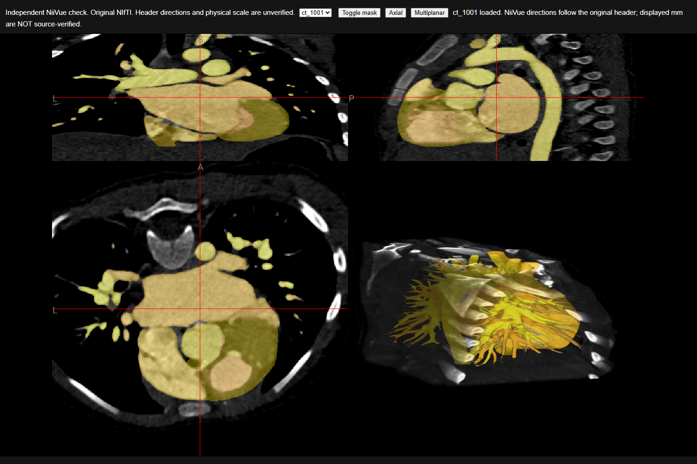
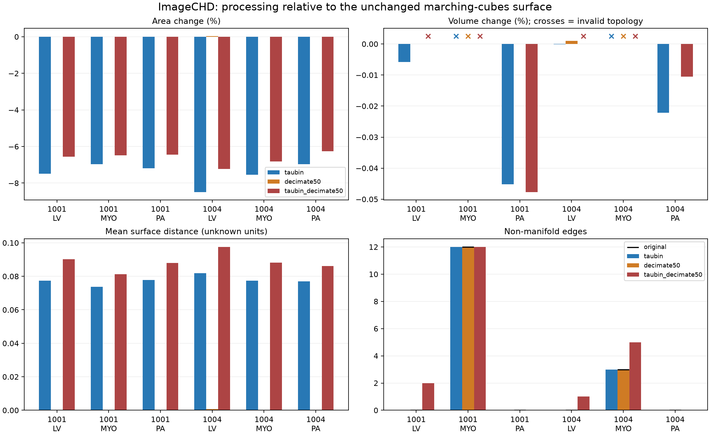

# Проверка геометрии и качества 3D-реконструкции

Дата: 28 сентября 2026. Ветка: `feature/geometry-validation`.

Проверены четыре пары ImageCHD, получены **27 исходных поверхностей** и **18 вариантов постобработки**. Совпадение сеток КТ и маски подтверждено, но физический масштаб пациента восстановить достоверно не удалось. Независимый просмотр выявил противоречие направления A/P анатомическому ориентиру. Исходные NIfTI не изменены; сглаживание, упрощение, замена spacing и анатомические перевороты не включены в основной pipeline.

## 1. Объём проверки и происхождение результатов

Использованы `ct_1001`, `ct_1002`, `ct_1003`, `ct_1004`: доступные полные пары в первом томе многотомного архива. Это выборка по доступности, не случайная или клинически стратифицированная выборка. При этом она включает разную глубину сканов, отсутствие одной метки и сильно различающуюся фрагментацию. Выводы о геометрии этих четырёх случаев не распространяются автоматически на остальные 106.

Каталог всего архива содержит 110 пар и две XLSX. Загрузчик проверяет CRC32 извлечённых файлов и сохраняет SHA-256. Для четырёх пар достаточно начальной части первого тома и заключительного тома с каталогом; весь набор около 8,94 ГБ не скачивался. Существующие файлы проходят проверку CRC и не заменяются несовпадающими данными.

Итоговый аудит выполнен в `outputs/geometry_validation/audit_final`, эксперимент — в `outputs/geometry_validation/postprocess_v1`. Ранний `audit_v1` сохранён отдельно: он был запущен до исправления обработки нормалей. Его mesh не являются эталоном для приведённых ниже объёмов. После исправления исходные поверхности заново построены из масок. Все сравнения постобработки используют исправленный, несглаженный marching cubes как baseline.

В Git включены только небольшие результаты проверки:

- [аудит случаев](validation/audit.json), [заголовки и SHA-256 восьми NIfTI](validation/headers.json);
- [проверка ключей XLSX и геометрические поля](validation/metadata.json);
- [27 исходных mesh: CSV](validation/raw_mesh_metrics.csv);
- [полный эксперимент с версиями, параметрами и хешами кода](validation/experiment.json);
- [исходные и обработанные модели: таблица](validation/postprocess_table.md), [CSV](validation/postprocess_metrics.csv);
- [чувствительность MYO ct_1001](validation/topology_probe_ct1001.json), [ct_1004](validation/topology_probe_ct1004.json);
- [независимый просмотр](validation/viewer_check.json) и четыре снимка NiiVue.

Полные объёмы, XLSX и VTP остаются в игнорируемых `data/` и `outputs/`. Из XLSX опубликованы только ID и параметры геометрии; даты, пол и диагнозы не экспортируются.

## 2. Соответствие файлов и таблиц

Проверены именно значения ключей, а не порядковые номера строк.

| Источник | Ключ | Результат |
|---|---|---|
| Каталог архива | число в `ct_XXXX_image.nii.gz` | 110 уникальных ID, 1001–1178 с пропусками |
| `imageCHD_dataset_info.xlsx`, лист `classification dataset` | `index`, столбец A | Все 110 ID точно совпадают с ID файлов; прямое соединение по ключу возможно |
| `imagechd_dataset_image_info.xlsx`, `Sheet1` | `idx`, столбец B | 110 уникальных idx, 1–178 с пропусками |

Для всего каталога установлено точное равенство множеств **`file_id = idx + 1000`**: ни лишних значений, ни пропусков, ни дублей в этих списках нет. Это сильное структурное свидетельство предполагаемой схемы нумерации. Однако авторская таблица соответствия, общий идентификатор исходной серии или журнал экспорта, доказывающий соответствие конкретного пациента конкретной строке параметров, не найдены. Совпадение множеств само по себе не доказывает такое соответствие. В коде сохранено `patient_row_correspondence_confirmed=false`, `apply_metadata_spacing=false`.

Порядок строк особенно опасно использовать как ключ: строки идут лексикографически (`1, 10, 101, ...`). Например:

| idx в XLSX | Номер строки | PixelSpacing J:K | calculate_z_thick M |
|---:|---:|---|---:|
| 1 | 1 | 0.29102, 0.29102 | 0.75 |
| 2 | 53 | 0.23438, 0.23438 | 0.75 |
| 3 | 62 | 0.30469, 0.30469 | 0.75 |
| 4 | 70 | 0.31836, 0.31836 | 0.75 |

**Это данные строк XLSX, а не назначенный spacing ct_1001–ct_1004.** Во всей таблице первое значение PixelSpacing меняется от 0.20703 до 0.91797; `calculate_z_thick`: 0.75 в 101 строке, 0.8 в 3, 0.9 в 1, 1.0 в 3 и 1.5 в 2. Название последнего поля не устанавливает, обозначает ли оно толщину реконструкции, расстояние между центрами срезов или вычисленную авторами величину.

Репозиторий авторов содержит описание меток, но не подтверждает связь `idx → file_id` или преобразования при экспорте. Поэтому применение этих величин как достоверных миллиметров отложено. [Источник авторов ImageCHD](https://github.com/XiaoweiXu/ImageCHD-A-3D-Computed-Tomography-Image-Dataset-for-Classification-of-Congenital-Heart-Disease).

## 3. Физическая геометрия

| Случай | Размер CT и mask | Метки без фона | Треугольники всех структур |
|---|---|---|---:|
| ct_1001 | 512 × 512 × 221 | 1–7 | 2 655 960 |
| ct_1002 | 512 × 512 × 137 | 1–7 | 1 046 444 |
| ct_1003 | 512 × 512 × 206 | 1–4, 6–7; **MYO отсутствует** | 671 194 |
| ct_1004 | 512 × 512 × 344 | 1–7 | 4 457 868 |

Во всех восьми файлах:

- `pixdim[1:4] = (1, 1, 1)`, длины столбцов affine также `(1, 1, 1)`;
- пространственные единицы — `unknown`;
- `qform_code=0`, `sform_code=1`; активна sform, оси по заголовку RAS;
- affine равна матрице ниже; исходные сетки КТ и маски внутри пары совпадают;
- нет ресэмплинга, изменения масштаба или назначенного из XLSX spacing.

```text
1  0  0  1
0  1  0  1
0  0  1  1
0  0  0  1
```

Геометрия независимо прочитана NiBabel и SimpleITK. Для сравнения матриц выполнено только преобразование описания координат SimpleITK LPS → RAS через `diag(-1,-1,1,1)`. После этого размеры и affine совпали для всех восьми файлов с допуском `1e-4`. Массивы этим действием не переворачивались. Это подтверждает согласованное чтение заголовка, а не истинность его физических параметров.

Шаг по Z равен **1 в неизвестных единицах заголовка**. Толщина среза отдельно в использованных NIfTI не установлена. Для восстановления расстояния между плоскостями нужны позиции срезов и направления из DICOM либо подтверждённый источник параметров экспортированного объёма; толщина и межсрезовый шаг не должны автоматически отождествляться. Даже подтверждение ключей XLSX не исключит ресэмплинг до создания NIfTI.

В работе SDF4CHD, приложение A, авторы также сообщают об отсутствии информации о spacing в ImageCHD и описывают собственную эвристику выравнивания протяжённости сердца по трём осям. Это внешний источник, согласующийся с найденным ограничением; их эвристика не восстанавливает измеренную геометрию пациента и здесь не применяется. [Kong et al., SDF4CHD, версия 2, приложение A](https://arxiv.org/html/2311.00332v2).

Площади ниже выражены в **единицах координат²**, объёмы — в **единицах координат³**, отклонения — в **единицах координат**. Их нельзя обозначать как мм², мл или миллиметры. При будущем анизотропном исправлении масштаба потребуется пересчитать также площади, отклонения и эффект сглаживания, а не только объём.

## 4. Ориентация и независимый просмотр

Все четыре исходные пары открыты в **NiiVue 0.69.0**, отдельном от NiBabel/PyVista движке чтения и визуализации. Проверка выполнена в Edge 154.0.4258.37 с WebGL; сохранены снимки трёх плоскостей с маской. На просмотренных срезах разметка совмещается с изображением сердца без очевидного глобального сдвига. Это качественная проверка совмещения, не экспертная оценка точности сегментации.

| Случай | Наблюдение на аксиальной плоскости | Вывод |
|---|---|---|
| [ct_1001](validation/ct_1001_niivue.png) | Позвоночник со стороны A, передняя грудная стенка с противоположной стороны | Направление A/P заголовка противоречит ориентиру |
| [ct_1002](validation/ct_1002_niivue.png) | То же расположение позвоночника относительно A | То же противоречие |
| [ct_1003](validation/ct_1003_niivue.png) | То же расположение позвоночника относительно A | То же противоречие; отсутствие MYO не меняет ориентир |
| [ct_1004](validation/ct_1004_niivue.png) | То же расположение позвоночника относительно A | То же противоречие |



На нижней левой панели позвоночник находится сверху, возле направления A, заданного заголовком. При единичной RAS-affine увеличение j соответствует A, хотя наблюдаемый ориентир указывает на заднюю сторону. Сагиттальная панель даёт согласующееся наблюдение по положению позвоночника и передней грудной стенки.

Это визуальное исследовательское наблюдение, не заключение рентгенолога и не полная восстановленная ориентация пациента. L/R не подтверждены исходными маркерами; положение сердца при врождённых пороках не используется как доказательство стороны. Полное соответствие S/I также требует отдельного подтверждения. Нельзя заменить отсутствие сведений одним глобальным переворотом для всего набора.

Автоматического анатомического исправления нет. Существующая канонизация NiBabel лишь переупорядочивает массив по уже записанной affine без интерполяции; для этих четырёх RAS-файлов она ничего не меняет. Изображения NiiVue используют окно **1000–2000 исходных значений**, не подтверждённые HU, и другую палитру маски, чем PyVista. Надписи направлений и возможные «mm» в интерфейсе NiiVue следуют заголовку и не доказывают истинную ориентацию или масштаб.

## 5. Компоненты и дефекты исходных поверхностей

В таблице каждая ячейка — **число 26-связных компонент маски / число вокселей вне крупнейшей компоненты**. Все компоненты сохранены.

| Структура | ct_1001 | ct_1002 | ct_1003 | ct_1004 |
|---|---:|---:|---:|---:|
| LV | 1 / 0 | 1 / 0 | 1 / 0 | 2 / 16 |
| RV | 1 / 0 | 1 / 0 | 1 / 0 | 1 / 0 |
| LA | 9 / 64 | 2 / 1 | 7 / 41 | 4 / 52 |
| RA | 1 / 0 | 1 / 0 | 1 / 0 | 1 / 0 |
| MYO | 3 / 67 | 1 / 0 | отсутствует | 18 / 3695 |
| AO | 1 / 0 | 1 / 0 | 2 / 1215 | 1 / 0 |
| PA | 7 / 77 | 1 / 0 | 13 / 44 | 7 / 113 |

Нельзя автоматически считать всё вне крупнейшей компоненты шумом: например, 1215 вокселей AO ct_1003 требуют отдельного просмотра. Отсутствие MYO — факт маски, не диагноз и не доказательство отсутствия ткани.

Компоненты поверхности посчитаны отдельно по связности вершин. Их число может превышать число компонент маски из-за внутренних оболочек полостей и различия определений связности. Например, RV ct_1004: одна компонента маски и 25 компонент поверхности. Это не означает наличие 25 отдельных правых желудочков. Все числа доступны в CSV и JSON, включая размеры компонент mesh по числу треугольников.

Во всех 27 исходных поверхностях после исправления нормалей:

- **0 открытых граничных рёбер**, 0 треугольников нулевой площади и 0 несогласованных по обходу рёбер с двумя соседними гранями;
- MYO ct_1001 имеет **12** неманифолдных рёбер; MYO ct_1004 — **3**; остальные 25 поверхностей — 0;
- ни одна метка не касается границы скана: искусственные крышки из-за обрезания объёма в этой выборке не выявлены;
- самопересечения, неманифолдные вершины и анатомическая правильность тонких перемычек отдельно не проверены.

Закрытые границы являются свойством построенной поверхности и не гарантируют полноту анатомической структуры или корректность сегментации.

### Ошибки обработки нормалей

Обнаружена ошибка предыдущей реализации: `auto_orient_normals=True` может направлять оболочку внутренней полости наружу от самой оболочки, вследствие чего её вклад в объём складывается с внешним вместо вычитания. На синтетическом кубе с полостью сумма по ориентированным треугольникам составляла 1044.333 вместо **927.000** для корректной границы материала. Число занятых вокселей здесь 936: разница с 927 обусловлена самой изоповерхностью marching cubes, а не потерей полости.

Отключения только auto-orient оказалось недостаточно: `consistent_normals=True` при обходе неманифолдного контакта создавало 17 несогласованных рёбер у MYO ct_1001 и 2 у MYO ct_1004. В текущем коде обе переориентации отключены; сохраняется обход треугольников marching cubes, включая инверсию порядка вершин при отражающей affine. Нормали вычисляются только для отображения. Геометрические координаты и исходные маски этим исправлением не меняются.

Регрессии покрывают полость, открытые и неманифолдные поверхности, отражение affine и все 255 непустых бинарных конфигураций блока 2×2×2. Это исправление алгоритма построения, а не попытка исправить данные пациента.

### Чувствительность к уровню marching cubes

| MYO | Уровень | Неманифолдных рёбер | Несогласованных рёбер после старого consistent_normals |
|---|---:|---:|---:|
| ct_1001 | 0.49 | 0 | 0 |
| ct_1001 | 0.50 | 12 | 17 |
| ct_1001 | 0.51 | 0 | 0 |
| ct_1004 | 0.49 | 0 | 0 |
| ct_1004 | 0.50 | 3 | 2 |
| ct_1004 | 0.51 | 0 | 0 |

До обработки нормалей несогласованных рёбер нет во всех шести вариантах. Исчезновение неманифолдных рёбер при малом сдвиге изоуровня указывает на чувствительность бинарных контактов к построению изоповерхности. Это не доказательство анатомической правильности 0.49 или 0.51: они перемещают границу и могут менять топологию. Основной уровень **0.5 сохранён**, автоматического ремонта и удаления компонент нет.

## 6. Эксперимент сглаживания и упрощения

Выбраны LV, MYO и PA случаев ct_1001 и ct_1004: камера, оболочка с дефектами и сосудистое дерево. Для каждой сохранены четыре независимых VTP: `original`, `taubin`, `decimate50`, `taubin_decimate50`. Всего 6 baseline и 18 обработанных вариантов; дополнительно рассчитаны baseline-метрики остальных структур для общей таблицы 27 mesh.

Параметры:

- **Taubin:** 20 итераций, pass band 0.1, окно Nuttall, нормализация координат; сглаживание границ, feature edges и неманифолдных контактов отключено.
- **DecimatePro:** целевое сокращение треугольников 50%, `preserve_topology=True`, `splitting=False`, `boundary_vertex_deletion=False`.
- **Комбинация:** сначала тот же Taubin, затем тот же DecimatePro.

Площадь рассчитана суммой площадей треугольников. Алгебраический объём — суммой ориентированных тетраэдров с началом около центра модели. `enclosed_volume` выдаётся только при отсутствии найденных граничных, неманифолдных, несогласованных рёбер и вырожденных треугольников. Для проблемных mesh он равен `null`; алгебраическая сумма остаётся только диагностикой. Даже допустимые по этим проверкам объёмы условны, поскольку самопересечения и неманифолдные вершины не проверены.

Отклонение: по 10 000 случайных точек, равномерно по площади треугольников, в каждом направлении; расстояние до ближайшей точки треугольной поверхности. Seeds `20260928`, `20260929`. Сохранены среднее двух направлений, максимум двух 95-х процентилей и выборочный максимум. Последний **не является точным расстоянием Хаусдорфа** и может пропускать локальные дефекты, особенно на малых компонентах.

Пример ct_1001 / LV (полная таблица всех шести структур — по ссылке ниже):

| Вариант | Вершины | Треугольники | Площадь, ед.² | Объём, ед.³ | Среднее отклонение | Неманифолдные рёбра |
|---|---:|---:|---:|---:|---:|---:|
| original | 88 234 | 176 536 | 66 540.570 | 505 783.833 | 0 | 0 |
| taubin | 88 234 | 176 536 | 61 552.779 | 505 754.510 | 0.077486 | 0 |
| decimate50 | 44 100 | 88 268 | 66 540.781 | 505 783.792 | 0.000002 | 0 |
| taubin_decimate50 | 44 100 | 88 268 | 62 183.500 | — | 0.090169 | **2** |

[Все абсолютные метрики до/после](validation/postprocess_table.md) · [CSV с процентными изменениями и отклонениями](validation/postprocess_metrics.csv).



Полученные результаты:

1. **Taubin** сохраняет число вершин и треугольников. Площадь уменьшается на **6.96–8.49%**; для четырёх допустимых по проверкам LV/PA абсолютное изменение объёма не превышает **0.046%**. Среднее отклонение — **0.0738–0.0818** единицы координат. Неманифолдные рёбра MYO остаются: сглаживание не исправляет их топологию.
2. **DecimatePro отдельно** достигает примерно 50% сокращения треугольников во всех шести структурах. Максимальное абсолютное изменение площади — **0.0304%**, допустимого объёма — **0.00097%**. Среднее отклонение не выше **0.000794**, но выборочный максимум достигает **0.2654** у LV ct_1004. Почти нулевые средние/95-е процентили отражают множество плоских участков исходной сетки и не означают доказанного нулевого локального изменения. Новых неманифолдных рёбер этим вариантом не найдено, исходные дефекты MYO сохранены.
3. **Taubin → DecimatePro** добавляет неманифолдные рёбра: LV ct_1001 `0→2`, LV ct_1004 `0→1`, MYO ct_1004 `3→5`. Поэтому комбинация не принята в основной pipeline, несмотря на `preserve_topology=True`. Малое среднее отклонение или изменение объёма не заменяет проверку связности и инцидентности рёбер после каждого фильтра.

Исходные массивы точек/граней baseline проверены на неизменность. SHA-256 масок до/после эксперимента совпали. КТ и маски всех четырёх случаев также проверены хешами до/после аудита. Финальная сверка всех восьми NIfTI с SHA-256 журнала извлечения из архива подтвердила полную неизменность. Все варианты являются дополнительными файлами; исходные VTP и NIfTI сохранены.

## 7. Решения и нерешённые вопросы

Принято:

- использовать текущую реконструкцию для исследования масок и алгоритмов в координатах заголовка;
- сохранять исходный обход marching cubes; не переориентировать вложенные оболочки автоматически;
- возвращать `null` вместо достоверного объёма при выявленных дефектах;
- хранить все компоненты и исходные mesh; оценивать варианты обработки отдельно;
- рассматривать DecimatePro отдельно как кандидата для будущего ускорения отображения после дополнительных проверок;
- не назначать параметры XLSX, не переворачивать анатомические оси и не принимать комбинацию фильтров по умолчанию.

Осталось неподтверждённым:

- индивидуальное соответствие строк параметров исходным сериям, несмотря на точный сдвиг ключей +1000;
- истинные PixelSpacing, межсрезовый шаг, толщина и единицы экспортированного объёма;
- полный patient-space transform, включая L/R и S/I, и причина противоречия A/P;
- калибровка интенсивностей в HU;
- правильность малых компонент, перемычек, отверстий и отсутствие MYO в ct_1003 с точки зрения исходной разметки;
- самопересечения, неманифолдные вершины, локальные изменения тонких ветвей и межструктурные пересечения после обработки;
- представительность четырёх случаев для всего набора.

Следующие шаги:

1. Получить от авторов документированную связь `idx/file_id/исходная серия`, сведения о ресэмплинге и DICOM-геометрию. При подтверждении создать отдельный manifest преобразований с исходными хешами, источником, матрицей, единицами и датой проверки; NIfTI не перезаписывать.
2. Провести совместную со специалистом проверку ориентиров и спорных компонент, прежде всего MYO ct_1004 и AO ct_1003. Не выводить сторону пациента только из положения сердца.
3. Расширить выборку по глубине скана, таблице acquisition-параметров и особенностям маски, затем выполнить аудит всех 110 пар при доступности диска и времени.
4. Добавить проверки самопересечений, веера граней вокруг вершин и целостности тонких ветвей. Исследовать ремонт конкретных контактов с измерением внесённых изменений.
5. После подтверждения физической геометрии повторить постобработку и сравнить отклонения уже в физических единицах.

Гемодинамика, обучение сегментации и разработка полноценного UI не выполнялись.

## 8. Повторный запуск

Из корня репозитория, PowerShell. Для каждого нового прогона указывайте новую пустую выходную папку. На Windows для SimpleITK используйте путь к данным без кириллицы: в этой среде чтение заголовка по абсолютному Unicode-пути не сработало; путь проекта `D:\codexProjects\3d-hearts` проверен.

```powershell
.\.venv\Scripts\python.exe -m pip install -r requirements-lock.txt
.\.venv\Scripts\python.exe scripts\fetch_sample.py --cases ct_1001 ct_1002 ct_1003 ct_1004

.\.venv\Scripts\python.exe -m heart3d.audit --data data\imagechd --cases ct_1001 ct_1002 ct_1003 ct_1004 --out outputs\validation_repeat\audit

.\.venv\Scripts\python.exe -m heart3d.postprocess --data data\imagechd --cases ct_1001 ct_1002 ct_1003 ct_1004 --process-cases ct_1001 ct_1004 --labels 1 5 7 --out outputs\validation_repeat\postprocess

.\.venv\Scripts\python.exe scripts\probe_topology.py --mask data\imagechd\ct_1001_label.nii.gz --out outputs\validation_repeat\topology_ct1001.json
.\.venv\Scripts\python.exe scripts\probe_topology.py --mask data\imagechd\ct_1004_label.nii.gz --out outputs\validation_repeat\topology_ct1004.json

.\.venv\Scripts\python.exe scripts\summarize_validation.py --audit outputs\validation_repeat\audit --experiment outputs\validation_repeat\postprocess\experiment.json --out outputs\validation_repeat\evidence

.\.venv\Scripts\python.exe -m pytest tests --ignore=tests/test_viewer.py -q
.\.venv\Scripts\python.exe -m pytest tests/test_viewer.py -q
```

Только таблицы/заголовки, без построения mesh:

```powershell
.\.venv\Scripts\python.exe -m heart3d.metadata_audit --data data\imagechd --out outputs\validation_repeat\metadata.json
.\.venv\Scripts\python.exe -m heart3d.geometry_audit --data data\imagechd --cases ct_1001 ct_1002 ct_1003 ct_1004 --out outputs\validation_repeat\headers.json
```

Независимая визуальная проверка:

```powershell
.\.venv\Scripts\python.exe scripts\serve_independent_viewer.py --data data\imagechd
# Открыть http://127.0.0.1:8765 в браузере. Остановить сервер: Ctrl+C.
```

Сервер слушает только `127.0.0.1` и отдаёт страницу и восемь явно перечисленных NIfTI. Для загрузки NiiVue 0.69.0 и его зависимостей нужен доступ к jsDelivr; данные читаются по локальному адресу. Снимки получены в headless Edge, затем просмотрены вручную; обычный браузер позволяет повторить ту же проверку. Визуальный результат не входит в автоматическое утверждение о правильной ориентации.

Для просмотра исправленных mesh основным PyVista viewer:

```powershell
.\.venv\Scripts\python.exe -m heart3d view outputs\validation_repeat\audit\ct_1001
```

Проверки: **21 тест без графического окна + 1 локальный графический тест прошли**. GitHub Actions настроен на все 21 неграфическую проверку без загрузки датасета. Зафиксированные NumPy/scikit-image дают предупреждения об устаревающем API изменения shape внутри библиотеки; тесты проходят. Сведения о версиях вычислительных библиотек и SHA-256 кода записаны в приложенных JSON; результаты сравниваются с численным допуском, а не по побайтовому равенству VTP.
