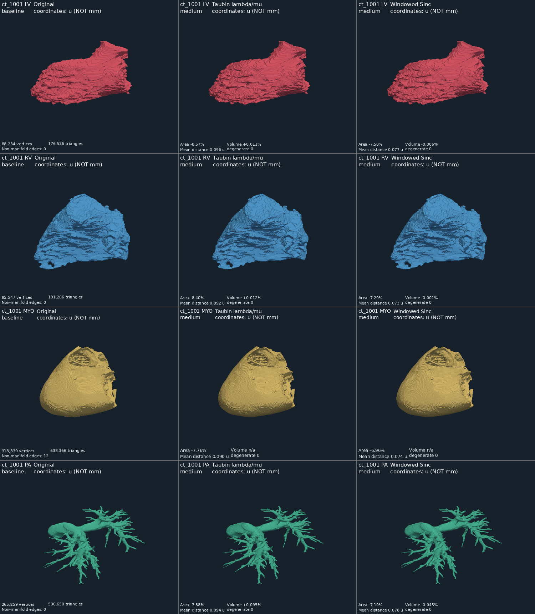
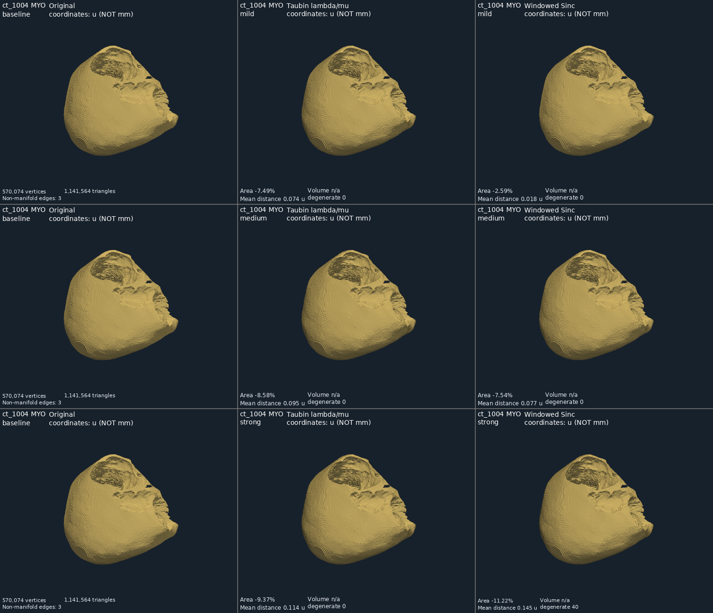
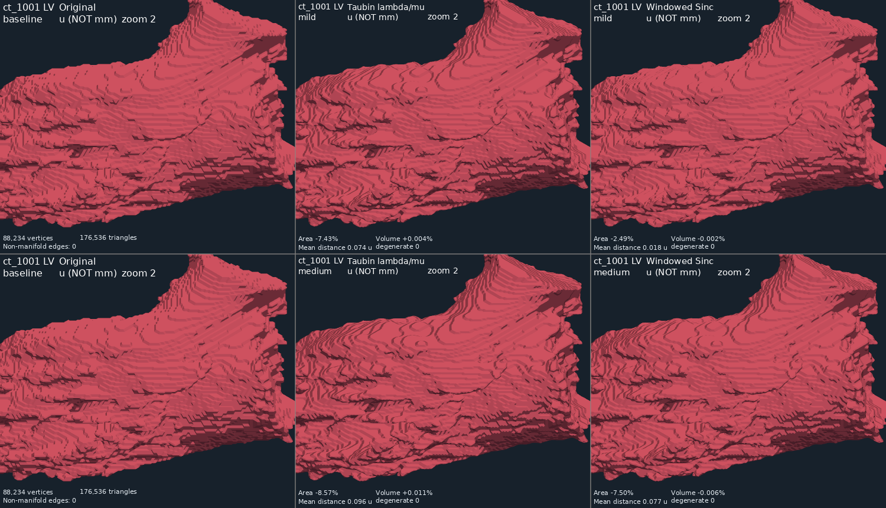

# Эксперимент сглаживания mesh · 29.09.2026

**Рекомендация:** для осторожного дополнительного просмотра — **Windowed Sinc, 10 итераций, pass band 0.15, окно Nuttall**. Это самый щадящий из проверенных профилей, но визуальный эффект умеренный. **Original следует сохранить основным вариантом:** даже мягкое сглаживание заметно уменьшает некоторые малые компоненты. Настройки viewer в этом этапе не менялись.

Проверены 27 исходных поверхностей `ct_1001–ct_1004`, по шесть независимых вариантов: **162 обработанных VTP**. MYO у `ct_1003` отсутствует и пропущен. Источник — проверенный прогон `outputs/validation_20260928_120859_296/audit`. Реконструкция, decimation и удаление компонент не выполнялись. Копии baseline побайтово совпадают с исходными VTP; SHA-256 всех 27 исходных VTP и четырёх отчётов после расчёта сохранились. NIfTI и affine не изменялись.

Ветка `feature/mesh-smoothing` создана от `origin/main` (`8813f5f`), куда к началу работы уже был слит PR с geometry validation и viewer. Слияний в main в рамках эксперимента не выполнялось.

## Методы и параметры

Важное уточнение: PyVista **`smooth_taubin()` вызывает `vtkWindowedSincPolyDataFilter`**. Поэтому сравнение двух вызовов под названиями «Taubin» и «Windowed Sinc» не было бы сравнением разных алгоритмов. В предыдущем эксперименте вариант `taubin` и пункт viewer `Smoothed` также использовали Windowed Sinc. [Документация PyVista](https://docs.pyvista.org/api/core/_autosummary/pyvista.polydatafilters.smooth_taubin).

Здесь `taubin` — отдельная реализация классического двухшагового λ/μ-фильтра: сначала `p ← p + λ(Wp − p)`, затем то же обновление с μ по уже обновлённым координатам. `W` усредняет уникальных соседей первого кольца с равными весами. Взяты λ = 0.6307 и kPB = 0.1 из примера статьи; μ = 1/(kPB − 1/λ) ≈ −0.6731559455. Обновление одновременное, через разреженную матрицу SciPy. [Taubin, SIGGRAPH 1995, формулы 7–9 и примеры](https://www.cs.jhu.edu/~misha/ReadingSeminar/Papers/Taubin95.pdf).

Windowed Sinc вычисляется VTK через PyVista. Nuttall выбран по рекомендации текущего API VTK; нормализация координат включена для численной устойчивости. Более низкий pass band усиливает фильтрацию; число итераций задаёт степень полиномиальной аппроксимации. Это не то же число шагов, что у λ/μ-фильтра. [VTK: описание фильтра и WindowFunction](https://vtk.org/doc/nightly/html/classvtkWindowedSincPolyDataFilter.html).

| Профиль | Taubin λ/μ | Windowed Sinc |
|---|---|---|
| mild | 5 пар, λ=0.6307, μ≈−0.6731559455 | 10 итераций, pass band=0.15, Nuttall |
| medium | 10 пар, те же λ/μ | 20 итераций, pass band=0.10, Nuttall |
| strong | 20 пар, те же λ/μ | 40 итераций, pass band=0.05, Nuttall |

Каждый профиль применяется непосредственно к baseline. У Taubin фиксируются вершины на граничных и неманифолдных рёбрах; у VTK отключены `boundary_smoothing`, `feature_smoothing`, `non_manifold_smoothing`, включён `normalize_coordinates`. Реализации используют собственные правила соседства, их тождественность не предполагается. Координаты обрабатываются в float64. После фильтра пересчитываются нормали без разделения вершин, изменения обхода граней и автоматической переориентации оболочек полостей.

Названия mild/medium/strong означают уровни **внутри метода**, а не равную силу двух фильтров. По уменьшению площади Taubin mild ближе к Windowed Sinc medium. Laplacian отдельно не добавлялся: уже сравниваются два разных фильтра. «Без усадки» не означает точного сохранения объёма: λ/μ-фильтр может увеличивать его, что наблюдалось и на синтетической сфере.

## Метрики и условия отбора

Единица **u** обозначает текущие координаты модели; физический spacing неизвестен. Площадь — u², объём — u³, расстояние — u; это не mm/ml.

Для каждого baseline и варианта записаны вершины, треугольники, площадь, условный объём, число компонент по общим вершинам, граничные/неманифолдные/несогласованно ориентированные рёбра и число треугольников с площадью ≤ 1e−12 u². Объём записывается только при пройденных проверках рёбер, обхода и вырожденности. Самопересечения и неманифолдные вершины не проверялись, поэтому даже численный объём остаётся условным. У MYO `ct_1001` и `ct_1004` он равен `null` во всех профилях.

Расстояния измеряются от точек одной поверхности до ближайших **треугольников** другой: 10 000 точек, равномерных по площади, в каждом направлении; фиксированные seeds 20260928 и 20260929. Среднее — полусумма двух направленных средних; максимум — максимум выборки. **Это не точное расстояние Хаусдорфа.**

Дополнительно вычислен максимум смещения всех соответствующих вершин. При неизменной связности он даёт верхнюю границу непрерывного расстояния Хаусдорфа: смещение точки с одинаковыми барицентрическими координатами ограничено максимумом смещений вершин её треугольника. Таким образом, выборочный максимум и эта граница ограничивают искомый максимум снизу и сверху с учётом численной точности. Среднее смещение вершин также сохранено, но не подменяет среднее расстояние поверхностей.

До расчёта заданы исследовательские пороги: без новых дефектов и изменения компонент, |ΔV| ≤ 2% для определённого объёма, среднее расстояние ≤ 0.35 u, максимум смещения вершин ≤ 1.5 u. Это инженерские критерии, не клинические допуски. Статус `candidate` означает только прохождение этих проверок. Последующая диагностика малых компонент показала, почему его недостаточно для выбора default.

## Численные результаты

Во всех 162 вариантах **число вершин, треугольников, связность и число компонент сохранены**. Во всех baseline и вариантах — 0 открытых граничных рёбер. Новых неманифолдных рёбер нет; у MYO `ct_1001` / `ct_1004` остаются прежние **12 / 3**.

В таблице ΔA — диапазон по 27 структурам; ΔV — только по структурам с определённым объёмом. Среднее расстояние приведено как медиана по структурам, два максимума — худшие значения среди 27 структур. Все расстояния в u.

| Профиль | ΔA, %: min…max | ΔV, %: min…max (n) | Медиана mean | Выборочный max | Верхняя граница H: max | Новая вырожденность |
|---|---:|---:|---:|---:|---:|---|
| Taubin mild | −8.489…−6.505 | +0.0018…+0.0706 (25) | 0.0733 | 0.4037 | 0.6112 | Нет |
| Taubin medium | −9.945…−7.181 | +0.0056…+0.1661 (25) | 0.0920 | 0.5630 | 0.7847 | Нет |
| Taubin strong | −11.110…−7.511 | +0.0136…+0.4003 (25) | 0.1097 | 0.6887 | 0.9384 | Нет |
| Windowed Sinc mild | −2.773…−2.302 | −0.0177…−0.0008 (25) | 0.0184 | 0.1249 | 0.1819 | Нет |
| Windowed Sinc medium | −8.493…−6.579 | −0.0907…−0.0001 (25) | 0.0768 | 0.4222 | 0.6271 | Нет |
| Windowed Sinc strong | −13.879…−8.311 | −0.1753…+0.0011 (12) | 0.1332 | 1.1538 | 1.3338 | 600 граней, 15 структур |

У strong Windowed Sinc осталось 12 структур с условно определённым объёмом: 13 потеряли этот статус из-за вырожденности, у двух MYO он отсутствовал изначально. Его диапазон ΔV нельзя сравнивать с другими строками как результат для всех 25 структур.

Полные значения для **27 baseline и 162 вариантов**, включая абсолютные площади/объёмы, V/F, компоненты, рёбра и расстояния: [таблица метрик](validation/smoothing_metrics_table.md). [Машиночитаемая сводка](validation/smoothing_summary.json). Полный JSON с параметрами, версиями, SHA-256 кода/источников/вариантов находится локально в `outputs/mesh_smoothing_20260929/smoothing_metrics.json`.

### Найденная проблема малых компонент

Сильный Windowed Sinc создал 600 практически вырожденных граней в **67 исходных компонентах**: 59 состояли из 8 треугольников, 8 — из 16. Размер массива и граф связности не меняются, но поверхность этих компонент почти схлопывается. Их исходная суммарная площадь на компоненту была 1.732–4.560 u²; после обработки — порядка 10⁻¹² u². Это воспроизведено отдельным тестом на октаэдре.

Площадь тех же 67 компонент уменьшается и на остальных профилях:

| Профиль | Потеря площади выявленных малых компонент |
|---|---:|
| Taubin mild | 81.88–99.19% |
| Taubin medium | 96.40–99.99% |
| Taubin strong | 99.855–99.9999996% |
| Windowed Sinc mild | 18.48–41.66% |
| Windowed Sinc medium | 85.74–99.73% |
| Windowed Sinc strong | Практически 100% |

Это дополнительный анализ компонент, выбранных по вырождению на сильном профиле, а не статистика всех компонент набора. [Результаты по каждой компоненте](validation/smoothing_small_components.json). Их анатомическое значение не установлено: автоматически считать их мусором или удалять нельзя. Малое изменение общего объёма и отсутствие новых non-manifold edges **не гарантируют сохранения локальных деталей**.

Особо проверены MYO: для `ct_1001` / `ct_1004` площадь на mild Windowed Sinc изменилась на −2.429 / −2.586%, на medium — −6.958 / −7.541%. Исходные 12 / 3 неманифолдных ребра сохранились. Strong добавил соответственно 8 / 40 вырожденных граней. Корректность объёма MYO этим экспериментом не восстановлена.

## Визуальное сравнение

Для каждой строки используются одна камера, одинаковый масштаб, освещение и плоское затенение. Режим затенения не переключается между Original и обработанными моделями. Камеры сохранены в JSON рядом с локальными снимками в `outputs/mesh_smoothing_20260929/figures`; параметры рендеринга воспроизводятся скриптом.







Видно смягчение мелких ступенчатых краёв; Taubin mild и Windowed Sinc medium дают сопоставимый эффект. Мягкий Windowed Sinc меняет изображение слабее. Широкие террасы и неоднородность маски остаются: обещать полностью гладкую анатомическую поверхность по этим параметрам нельзя. У сильного профиля поверхность мягче, но обзорный ракурс не выявляет схлопнувшиеся малые компоненты — их обнаружили численные проверки. Наблюдения относятся к выбранным структурам и ракурсам, не к экспертной оценке всех срезов.

## Решения и ограничения

1. **Минимальное искажение относительно baseline:** Windowed Sinc mild. В этих данных |ΔV| < 0.018% для 25 условно измеримых структур, mean ≤ 0.019 u, верхняя граница H ≤ 0.182 u. Это не подтверждение близости к истинной анатомии.
2. **Более заметное сглаживание:** Windowed Sinc medium или Taubin mild. Первый лучше сохраняет объём по медиане абсолютного изменения, второй немного меньше смещает поверхность; абсолютного победителя по всем метрикам нет. Оба существенно уменьшают выявленные малые компоненты.
3. **Strong Windowed Sinc отклонён** как универсальный профиль из-за новых вырожденных граней. Taubin strong не дал новой вырожденности по заданному порогу, но сильнее меняет объём и локальные детали, поэтому предпочтения не получил.
4. **Default не менять.** Мягкий Windowed Sinc допустим как явно выбранный исследовательский вариант просмотра с доступным Original. Для назначения основным видом сначала нужны проверка малых компонент и политика их защиты. Встроенный viewer остался без изменений; новые варианты сравниваются отдельным скриптом.
5. Нет ground truth гладкой поверхности, подтверждённого spacing, проверки самопересечений, неманифолдных вершин и экспертной оценки тонких ветвей. Сглаживание не исправляет эти ограничения и не является ремонтом топологии.

Следующий небольшой эксперимент: защищать согласованные со специалистом малые компоненты/тонкие детали и сравнить с изменением только нормалей освещения (`smooth_shading`) без движения вершин. Не усиливать smoothing ради внешнего вида до подтверждения геометрии.

## Воспроизведение

Из корня проекта, в ветке `feature/mesh-smoothing`; зависимости прежние, SciPy/PyVista/VTK уже входят в lock-файл. Проверенная среда: Python 3.14, NumPy 2.5.3, SciPy 1.18.1, PyVista 0.49.0, VTK 9.7.0. Основной расчёт на этой машине занял около 6 минут 44 секунд; время не является гарантией производительности.

```powershell
$out = 'outputs\mesh_smoothing_' + (Get-Date -Format 'yyyyMMdd_HHmmss_fff')
.\.venv\Scripts\python.exe -m heart3d.smoothing_experiment --audit outputs\validation_20260928_120859_296\audit --cases ct_1001 ct_1002 ct_1003 ct_1004 --out $out
.\.venv\Scripts\python.exe scripts\summarize_smoothing.py --metrics "$out\smoothing_metrics.json" --out "$out\summary"
.\.venv\Scripts\python.exe scripts\inspect_smoothing_degeneracy.py --run $out --out "$out\components.json"
.\.venv\Scripts\python.exe scripts\compare_smoothing.py --run $out --case ct_1001 --labels 1 2 5 7 --levels medium --out "$out\compare.png"
```

Новый расчёт не нужен для просмотра уже полученных результатов. Например, открыть связанную интерактивную тройку для LV на рекомендуемом мягком профиле:

```powershell
$image = 'outputs\smoothing_compare_' + (Get-Date -Format 'yyyyMMdd_HHmmss_fff') + '.png'
.\.venv\Scripts\python.exe scripts\compare_smoothing.py --run outputs\mesh_smoothing_20260929 --case ct_1001 --labels 1 --levels mild --out $image --interactive
```

ЛКМ — вращение, колесо — масштаб, средняя кнопка — перемещение. Камера связана между тремя методами одной строки. `--levels mild medium strong` позволяет сравнить три уровня одной структуры; `--zoom 2` — увеличить фрагмент. Не более четырёх строк на изображение. Отсутствующие структуры пропускаются. Исходные VTP не перезаписываются; существующий непустой каталог/файл результата отклоняется. Частичный JSON без `completed: true` нельзя считать законченным экспериментом.

Файлы устроены так: `CASE/STRUCTURE/baseline.vtp`, `taubin/{mild,medium,strong}.vtp`, `windowed_sinc/{mild,medium,strong}.vtp`. Все тяжёлые VTP остаются в игнорируемом `outputs`; в Git добавлены код, таблицы, компактные результаты и три иллюстрации отчёта.

**Проверки:** `python -m pytest -q` — **40 passed**, включая прежние 31 тест и девять новых. Проверены последовательные λ/μ-обновления, перенос координат, неизменность исходника, связность, границы, компоненты, соответствие Windowed Sinc фильтру PyVista, расстояния и их граница, запрет перезаписи и обнаружение схлопнувшейся оболочки. Отдельно проверены сохранение изображений и интерактивное окно сравнения. CI настроен на 38 неграфических тестов; два графических выполняются локально. Прежние 320 предупреждений об API NumPy/scikit-image остаются предупреждениями, не ошибками.
