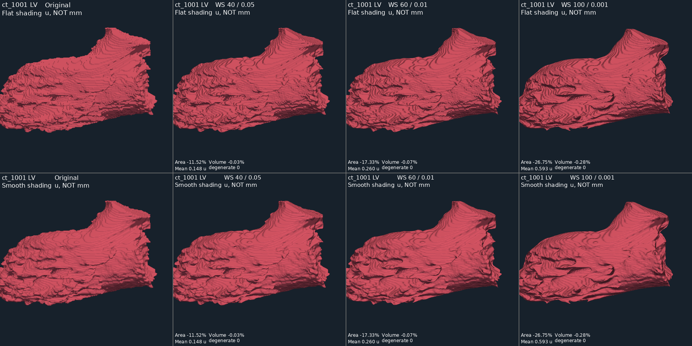

# Можно ли убрать ступеньки без потерь?

**Геометрические ступеньки нельзя удалить, одновременно сохранив прежнюю поверхность.** Можно сгладить освещение, не изменяя вершины: это уменьшает видимость граней треугольников, но не исправляет ступенчатый силуэт. Перестроение поверхности требует оценки того, где должна проходить граница между вокселями. Изменение маски не обязательно означает потерю истинной анатомии, но подтвердить улучшение по одной маске нельзя.

Это продолжение [первого эксперимента](mesh_smoothing_experiment.md), проведённое 29.09.2026 после замечания о слабом визуальном эффекте. Предыдущая рекомендация mild минимизировала отклонение от baseline; она не решала задачу удаления широких террас.

## Что проверено

В обоих существующих viewer используется `smooth_shading=False`. Новый отдельный скрипт сравнивает плоское и гладкое освещение на **одной и той же геометрии**, с общей камерой, одинаковыми цветом и освещением. Гладкое освещение Phong интерполирует нормали; это не сглаживание координат. [Документация PyVista](https://docs.pyvista.org/examples/02-plot/shading).

Проверены семь поверхностей: ct_1001 — LV, RV, MYO, PA; ct_1002 — LV; ct_1003 — RV; ct_1004 — MYO. Это целевая проба, не повторный полный аудит всех структур.

Испытаны Windowed Sinc / Nuttall: **40 итераций / pass band 0.05**, **60 / 0.01**, **100 / 0.001**. Уменьшение pass band усиливает фильтрацию, число итераций задаёт степень аппроксимации фильтра. [VTK](https://vtk.org/doc/nightly/html/classvtkWindowedSincPolyDataFilter.html). Прочие настройки прежние: normalize coordinates, без boundary/feature/non-manifold smoothing.

В отличие от предыдущего эксперимента, теперь сглаживается только крупнейшая по числу треугольников связная компонента. Координаты **всех остальных компонент восстанавливаются точно**, без удаления, слияния или decimation. Это исследовательская эвристика, а не определение анатомической значимости. Она сохраняет отдельные оболочки, но **не защищает тонкие ветви внутри крупнейшей компоненты** и не исправляет исходные дефекты MYO. При равенстве размеров выбирается первая компонента, возвращённая VTK.

Каждый вариант строится непосредственно из baseline. Исходные VTP, NIfTI и встроенный viewer не изменены; Original остаётся default. Единицы — u, не подтверждённые mm. Для каждого варианта записаны полные прежние метрики, SHA-256, параметры и число защищённых вершин.

## Результаты

| Профиль | Изменение площади по 7 поверхностям | Изменение объёма по 5 допустимым поверхностям | Среднее расстояние, u | Максимум смещения вершины, u |
|---|---:|---:|---:|---:|
| 40 / 0.05 | −11.93…−9.67% | −0.224…+0.001% | 0.133…0.148 | 1.018…1.267 |
| 60 / 0.01 | −18.00…−13.11% | −1.498…+0.041% | 0.207…0.270 | 2.133…2.741 |
| 100 / 0.001 | −33.40…−19.50% | −7.932…+0.066% | 0.419…0.654 | 4.366…5.448 |

Расстояния: по 10 000 точек в каждом направлении, те же фиксированные seeds и расстояния до треугольников. Максимум смещения соответствующих вершин ограничивает расстояние Хаусдорфа сверху; это не точное расстояние Хаусдорфа.

У всех 21 вариантов сохранены числа вершин, граней и связных компонент; новых открытых границ, non-manifold edges, несогласованных рёбер и вырожденных треугольников не обнаружено. Все защищённые вершины совпадают с baseline. В отличие от прежнего strong, малые отдельные оболочки не схлопнулись. Исходные 12 / 3 non-manifold edges MYO ct_1001 / ct_1004 сохраняются, их объёмы остаются неопределёнными. Самопересечения, контакты между структурами и неманифолдные вершины не проверялись.

Профиль 40 / 0.05 проходит прежние численные пороги для пяти поверхностей; оба MYO остаются `review_invalid_baseline`. Профили 60 / 0.01 и 100 / 0.001 **отклонены во всех семи случаях** из-за превышения ранее принятого порога смещения 1.5 u. Это исследовательский порог, а не клинический допуск. У самого сильного профиля PA ct_1001 дополнительно теряет **7.93% объёма**. У LV того же случая объём меняется всего на −0.28%, но площадь — на −26.75%: сохранение общего объёма не доказывает сохранение формы.

Полные результаты: [JSON](validation/smoothing_followup.json). Локальные VTP и все три изображения: `outputs/smoothing_probe_20260929_final`.



На LV гладкое освещение смягчает грани, но широкие террасы остаются. Усиление фильтра округляет их края и изменяет складки; равномерно гладкая поверхность не получена. На PA сильнейший фильтр заметнее округляет форму ценой большего изменения объёма. Визуальное наблюдение относится к выбранным ракурсам, не к экспертной оценке анатомии.

## Что делать дальше

1. Для отображения можно использовать smooth shading как отдельную опцию: координаты и метрики при этом сохраняются, но мелкие изломы становятся менее заметными. Полезно оставлять переключение обратно на flat shading для контроля.
2. **40 / 0.05 с защитой остальных компонент** — более выраженный вариант для дальнейшего сравнения, не новый default. Для универсального использования необходим полный аудит 27 поверхностей и проверка тонких деталей/самопересечений. Значительная часть террас всё ещё остаётся.
3. Простое дальнейшее усиление фильтра не рекомендовано: получаем большие локальные смещения, а результат ещё не решает визуальную задачу полностью.
4. Следующая гипотеза — реконструкция через сглаженное знаковое поле расстояний от маски с несколькими масштабами, а затем сопоставление новой границы с КТ, исходной маской и соседними структурами. Это **не выполненный здесь метод и не гарантия качества**. Он может изменить топологию и тонкие детали, поэтому его надо исследовать отдельно. После подтверждения spacing масштаб сглаживания нужно задавать в физических единицах.

## Можно ли вернуть объём масштабированием?

Да. Для корректно определённых положительных объёмов коэффициент равномерного масштабирования равен `s = (V_original / V_smoothed)^(1/3)`, а новые координаты — `p_new = c + s * (p_smoothed - c)`, где `c` — явно выбранный центр. Такая коррекция описана, например, в [Desbrun et al., SIGGRAPH 1999, §3.2](https://www.multires.caltech.edu/pubs/ImplicitFairing.pdf). Для полученного уменьшения объёма PA на 7.93% линейное увеличение составило бы около 2.79%.

Это восстанавливает общий объём, но не исчезнувшие ветви, исходные диаметры и взаимное расположение структур. Если масштабировать всю модель, координаты защищённых компонент тоже изменятся, нарушив правило этого эксперимента. Коррекция только основной компоненты требует отдельного расчёта её объёма и проверки отношений с сохранёнными оболочками. Для MYO с исходной некорректной топологией надёжного целевого объёма пока нет. Неизвестный физический масштаб не мешает вычислить отношение двух объёмов в одной системе координат, но результат от этого не становится измерением в ml.

**Коррекция объёма здесь не применялась.** Она подходит как следующий контрольный вариант; сравнивать нужно также поверхность, тонкие ветви, контуры на КТ и контакты структур. Второе направление — сглаживание с ограничениями на объём и локальное смещение, но возможность соблюсти все ограничения при желаемой гладкости надо проверять, а не предполагать.

## Повторение

Полный целевой прогон семи поверхностей (создаёт новый каталог):

```powershell
$out = 'outputs\smoothing_probe_' + (Get-Date -Format 'yyyyMMdd_HHmmss_fff')
.\.venv\Scripts\python.exe scripts\probe_smoothing.py --run outputs\mesh_smoothing_20260929 --out $out
```

Просмотр уже полученных вариантов без повторного расчёта:

```powershell
$image = 'outputs\smoothing_view_' + (Get-Date -Format 'yyyyMMdd_HHmmss_fff') + '.png'
.\.venv\Scripts\python.exe scripts\probe_smoothing.py --run outputs\smoothing_probe_20260929_final --view ct_1001:LV --out $image --interactive
```

`--view ct_1004:MYO` или `ct_1001:PA` выбирает другую измеренную структуру. Без `--interactive` сохраняется только изображение. Камеры панелей связаны; PNG и JSON камеры не перезаписываются. Для нового расчёта `--select ct_1001:LV ct_1004:MYO` ограничивает выборку.

**Проверки:** `python -m pytest -q` — **43 passed**, включая три новых теста защиты малой оболочки на всех профилях. Рендеры flat/smooth выполнены; перед/после отображения проверена неизменность координат и граней. Хеши семи исходников сохранены. Большие VTP остаются вне Git.
